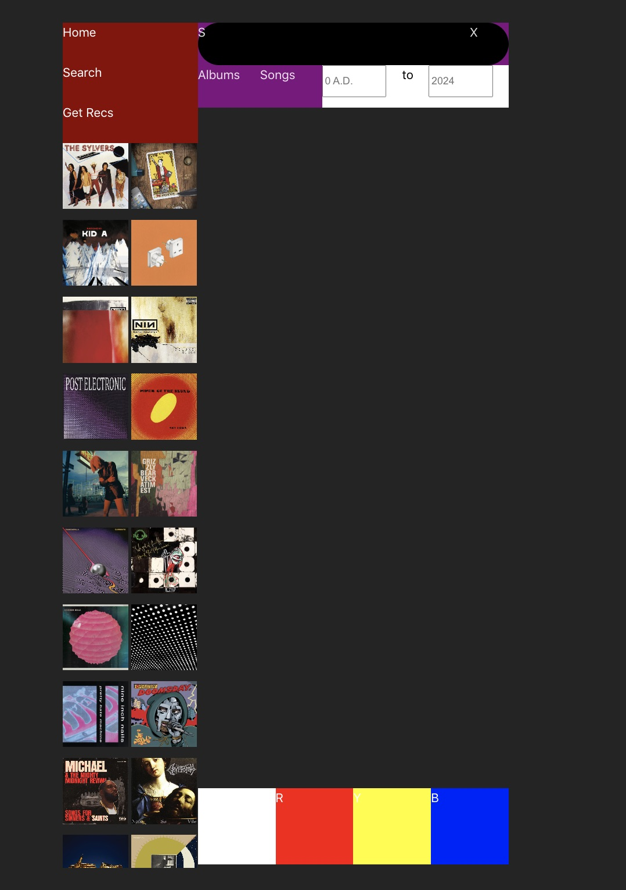
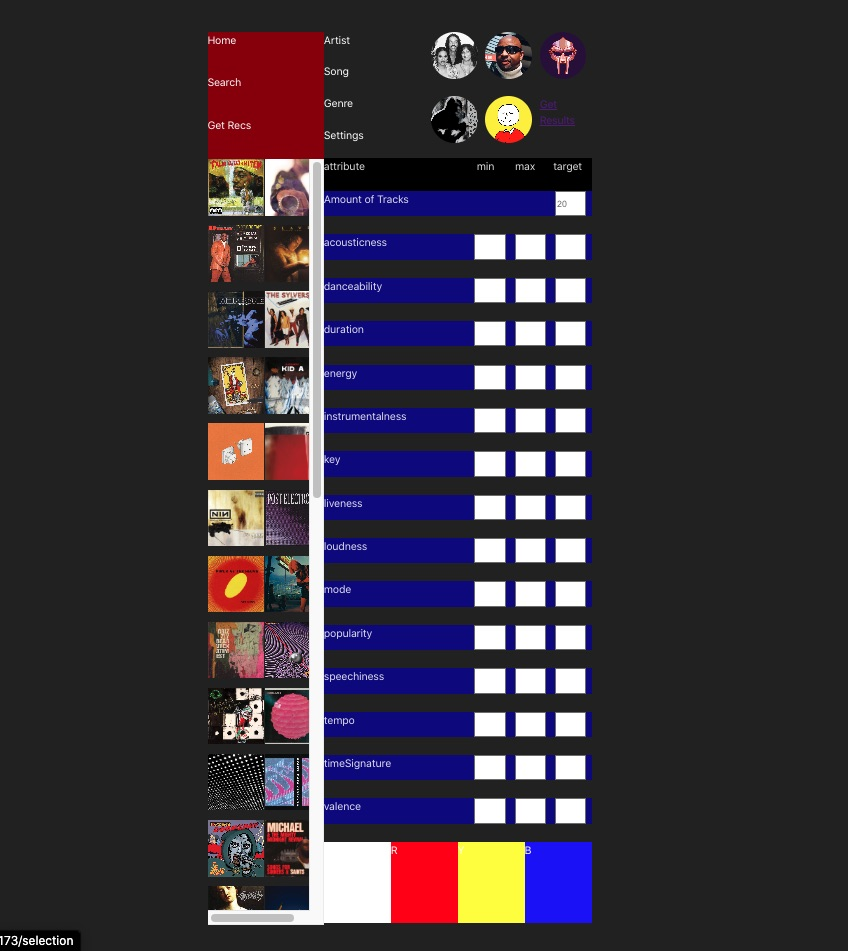

# Unstyled Music App

This project is a music app concept featuring functionalities like user-curated sidebars, search with year filtering, and custom playlists with sub-queues and true shuffle.

**Features:**

  * **Search:**
      * Find specific songs or albums with ease.
      * Filter results by year range using intuitive inputs.
      
  * **Custom Playlist Generator:**
      * Create personalized playlists utilizing Spotify's seed and settings method.
      
  * **Custom Playlists:**
      * Create personalized playlists with the freedom of sub-queues
      * Enjoy true shuffle functionality that avoids repeated songs within a short timeframe.
  * **Unstyled:**
      * This initial version focuses on core functionality, leaving room for future customization.
  * **Firebase Functions:**
      * Leverage Firebase functions to handle Spotify token reauthorization seamlessly, ensuring uninterrupted listening.

**Running the App:**

1. **Client:**
   * Navigate to the `client` directory.
   * Run `npm run dev` to start the development server.
2. **Firebase Functions:**
   * Navigate to the `functions` directory.
   * Run `firebase emulators:start --only functions` to start the Firebase emulators.

**Future Development:**

  * Implement a user interface with a clean and intuitive design.
  * Integrate additional music streaming services.
  * Explore social features for sharing playlists and recommendations.

**Feel free to contribute\!**

This project welcomes collaboration and contributions. If you'd like to get involved, feel free to reach out\!